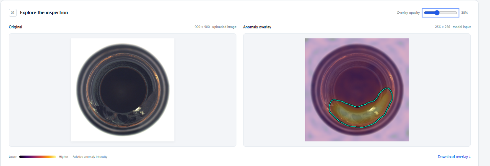
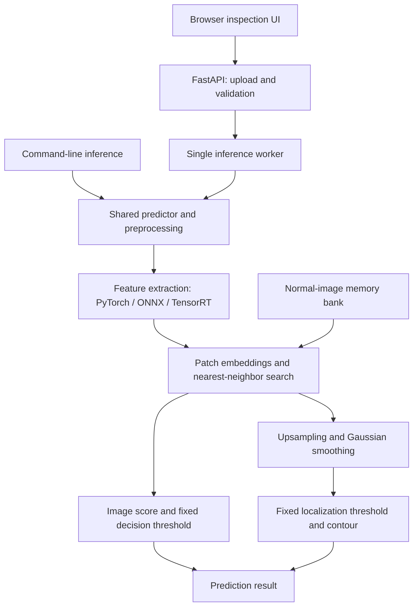

# Visual Quality Control

Visual anomaly detection for manufacturing inspection: from a reconstruction
baseline to a GPU-accelerated PatchCore pipeline, a local API and an interactive
inspection interface.

Built with **Python · PyTorch · Anomalib · ONNX Runtime · TensorRT · FastAPI**.
Evaluated on the **bottle** category of MVTec AD.



*Actual application screenshot. The contour is a thresholded model estimate,
not a ground-truth boundary. Image: MVTec AD, bottle category.*

## What this project demonstrates

- A reproducible training/calibration split and a normal-image memory bank.
- Comparison of a convolutional autoencoder baseline with PatchCore.
- Separate evaluation of image decisions and pixel-level localization.
- Profiling-driven optimization: TensorRT feature extraction and separable
  Gaussian smoothing, with numerical checks before performance comparisons.
- A shared prediction interface for PyTorch, ONNX Runtime and TensorRT.
- An API and browser interface with image upload, scores, timings, overlays,
  calibrated contours and downloadable results.
- Artifact identity checks, worker lifecycle tests, restart verification and
  installed-package checks for the GUI assets.

The engineering focus is the complete inspection system: data handling,
calibration, inference, validation, optimization and delivery. PatchCore itself
uses the implementation provided by Anomalib; it is not a new algorithm.

## Results at a glance

These are project measurements on one MVTec AD category and one RTX 5080 system.
They are not estimates of performance on arbitrary products or production data.

### Image-level detection

The test set contains **63 defective and 20 normal images**. Thresholds were
calibrated using normal validation images.

| Method | Recall | Precision | False-positive rate | F1 |
| --- | ---: | ---: | ---: | ---: |
| Convolutional autoencoder, MSE score, 250 epochs | 55.56% | 94.59% | 10.00% | 70.00% |
| PatchCore | 100.00% | 100.00% | 0.00% | 100.00% |

PatchCore: **TP 63, FN 0, FP 0, TN 20; image AUROC 1.0000** in the recorded
baseline. Subsequent backend and optimized-pipeline checks preserved every
image decision on this test set.

The autoencoder experiment remains a useful baseline: better reconstruction
loss alone did not yield strong anomaly detection. An SSIM-based scoring
experiment also underperformed the MSE baseline.

### Localization

Threshold-independent results from the recorded PatchCore baseline:
**pixel AUROC 0.984735**, **pixel average precision 0.759187**.

The deployed TensorRT + separable-blur configuration was also evaluated with a
fixed localization threshold at **256 × 256** resolution:

| Metric | Result |
| --- | ---: |
| Pooled pixel IoU | 0.457132 |
| Pooled pixel Dice | 0.627441 |
| Pooled pixel precision | 46.22% |
| Pooled pixel recall | 97.66% |
| Macro IoU over 63 defective images | 0.437440 |
| Normal images with any flagged region | 0 / 20 |

Pooled metrics aggregate pixel counts over all 83 images. Ground-truth masks
were resized with nearest-neighbor interpolation. High recall and lower
precision indicate broad predicted regions: **the system locates suspicious
areas, but does not provide precise defect boundaries or physical area measurements**.

### Inference optimization

Historical paired benchmark, RTX 5080, IEEE FP32, TF32 disabled:

| Configuration | Batch 1 mean latency | Batch 8 mean latency |
| --- | ---: | ---: |
| PyTorch + original 2D blur | 7.075 ms | 25.722 ms |
| TensorRT FP32 + original 2D blur | 3.954 ms | 20.589 ms |
| TensorRT FP32 + separable blur | **2.971 ms** | **12.610 ms** |
| Combined speedup over PyTorch | **2.381×** | **2.040×** |

Latency is **per batch**. Scope: prepared CPU RGB batch → GPU transfer →
normalization → complete PatchCore inference → scores, labels and maps on CPU.
Disk I/O, decoding, resizing and batch construction are excluded, as are API,
visualization and browser overhead. Each configuration used 30 warmup calls and
120 measured calls, with balanced, shuffled execution order.

These are short-run measurements of the original validated engine, not service
latency guarantees. The subsequently rebuilt engine passed correctness checks
but was not benchmarked again.

## Architecture



TensorRT accelerates the **feature extractor**. Patch embedding assembly,
nearest-neighbor scoring and map processing remain in the PyTorch pipeline.
The image decision and the localization contour use separate calibrated
thresholds. See [architecture and artifact flow](docs/architecture.md).

## Data and evaluation protocol

- Dataset: original MVTec AD, bottle category.
- Normal training images: 209, split into **167 memory-bank images** and
  **42 validation/calibration images** using a recorded seed and manifest.
- Test images: 83, preserving the original test split.
- Input: RGB, resized to 256 × 256; the feature extractor receives normalized
  float32 tensors.
- PatchCore: Wide ResNet-50-2, `layer2` and `layer3`, 1% coreset,
  1,710 stored feature vectors of dimension 1,536.
- Image threshold: 95th percentile of normal validation image scores, using
  the `higher` quantile method and the decision rule `score > threshold`.
- Localization threshold: 95th percentile of per-image map maxima on the same
  42 normal validation images, using `anomaly_map > threshold`.

The calibration alarm rate is an observation on those 42 images, not a promised
false-positive rate on future data. The test set was reused for engineering
parity checks and error analysis; it is not an untouched production holdout.

## Run the application

### New checkout

Follow [the reproduction guide](docs/reproduction.md) for environment setup,
data download, memory-bank creation, calibration, ONNX export, TensorRT build,
verification and application startup. Dataset files and model artifacts are
not included in Git. Cloning alone is not sufficient to run inference.

The guide distinguishes the verified artifact rebuild from a complete fresh
installation and memory-bank rebuild, which has not yet been independently
replayed. Recorded dependencies target Python 3.10 on Linux/WSL with CUDA.

### Existing verified project workspace

From the repository root, activate the environment and start the original demo:

```bash
source .venv/bin/activate

VQC_CONFIG="$PWD/configs/runtime/patchcore_tensorrt.json" \
VQC_LOCALIZATION_CALIBRATION="$PWD/artifacts/runs/patchcore_20261003_135714_557111/localization_calibration/20261003_182936_190431/threshold.json" \
python -m uvicorn visual_quality.api.app:app \
  --host 127.0.0.1 --port 8000 --workers 1
```

Open **http://127.0.0.1:8000/** to upload a PNG/JPEG and inspect the result.
Interactive API documentation is at **http://127.0.0.1:8000/docs**.
The command above requires the original local artifacts; newly reproduced
artifacts use the paths generated in the reproduction guide.

API endpoints:

| Endpoint | Purpose |
| --- | --- |
| `GET /health` | Application readiness, worker occupancy and active backend |
| `POST /predict` | Image score, decision, runtime identifiers and timings |
| `POST /predict?include_visualization=true` | Prediction with image/heatmap visualization and localization when configured |

The service uses one inference worker and rejects overlapping inference work
with HTTP 429. It is a localhost demonstration, without authentication or a
production deployment layer. Model scores are not probabilities. Heatmap colors
are normalized per image; compare calibrated decisions rather than colors
between images.

## Verification and implementation notes

- **Backend parity:** IEEE FP32 comparisons at batch sizes 1 and 8 over all 83
  test images, including image scores, anomaly maps and decisions.
- **ONNX approval:** generated per export, bound to the checkpoint, calibration,
  ONNX file and supporting evidence; CPU/GPU feature differences remain visible
  as diagnostics rather than being relabeled as successful feature parity.
- **API behavior:** malformed-input checks, 8 controlled worker tests and two
  real-server lifecycle checks per restart experiment.
- **Artifact checks:** 10 unit tests covering changed artifacts, thresholds,
  incomplete checks and invalid approval status.
- **Packaging:** installed-wheel imports and GUI responses checked outside the
  source checkout, while reusing the existing environment's dependencies.

| Location | Contents |
| --- | --- |
| [`src/visual_quality`](src/visual_quality) | Data, models, inference and API implementation |
| [`scripts`](scripts) | Training, calibration, export, evaluation and verification commands |
| [`configs`](configs) | Recorded split, model and runtime configurations |
| [`tests`](tests) | Controlled worker and export-validation tests |
| [`docs/reproduction.md`](docs/reproduction.md) | Reproduction commands and verified scope |
| [`docs/verification`](docs/verification) | API, packaging and artifact-rebuild evidence |
| [`docs/experiments`](docs/experiments) | Baseline, export and localization reports |
| [`docs/benchmarks`](docs/benchmarks) | Recorded performance experiments |

## Limitations and next steps

The current scope is one dataset category, one workstation and FP32 inference.
It does not demonstrate cross-product generalization, camera integration,
robustness to production lighting changes, sustained multi-client throughput
or recovery from GPU faults. Contours can overestimate defect extent.

Potential follow-up work includes an independent dataset evaluation, a clean
machine reproduction and FP16 experiments with the same correctness gates.
These are not required to use the current local demonstration.

## References and attribution

- Roth et al., **Towards Total Recall in Industrial Anomaly Detection**, CVPR 2022
  ([PatchCore paper](https://openaccess.thecvf.com/content/CVPR2022/html/Roth_Towards_Total_Recall_in_Industrial_Anomaly_Detection_CVPR_2022_paper.html)).
- Bergmann et al., **MVTec AD — A Comprehensive Real-World Dataset for
  Unsupervised Anomaly Detection**, CVPR 2019
  ([dataset paper](https://openaccess.thecvf.com/content_CVPR_2019/html/Bergmann_MVTec_AD_--_A_Comprehensive_Real-World_Dataset_for_Unsupervised_Anomaly_CVPR_2019_paper.html)).
- [MVTec AD dataset and license](https://www.mvtec.com/research-teaching/datasets/mvtec-ad).
  Dataset imagery shown in the demonstration is from MVTec AD; see its
  CC BY-NC-SA 4.0 terms and [dataset documentation](docs/dataset.md).
- [Anomalib](https://github.com/open-edge-platform/anomalib) provides the underlying
  PatchCore implementation used in this project.
