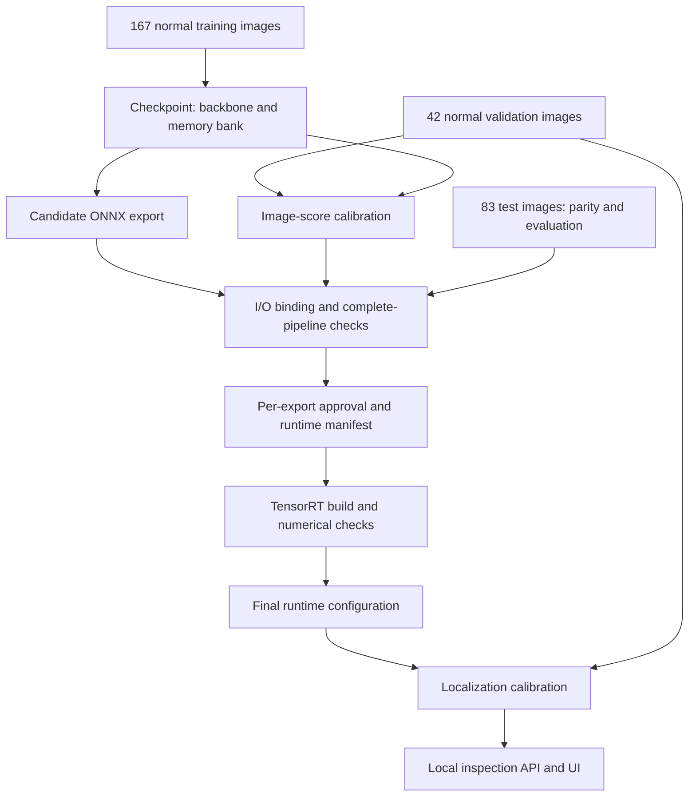

# Architecture and artifact flow

## Inference responsibilities

The shared `PatchcorePredictor` owns preprocessing, normalization, the calibrated
image threshold and the complete PatchCore pipeline. Its feature extractor is
selected explicitly: PyTorch, ONNX Runtime CUDA with I/O binding, or TensorRT
FP32. Feature outputs retain the same two-layer contract.

| Boundary | Contract |
| --- | --- |
| Image preparation | PIL image → CPU RGB float32 tensor, 3 × 256 × 256, values 0–1 |
| Predictor input | Batch of prepared RGB tensors before normalization |
| Exported feature extractor | Normalized float32 input; `layer2` and `layer3` feature maps |
| Predictor output | Image scores, boolean labels and anomaly maps on the inference device |
| API output | JSON metadata and timings; optional PNG visualizations encoded in base64 |

The exported graph contains the feature extractor, not the entire PatchCore
system. Feature pooling, embedding assembly, nearest-neighbor search, image
scoring and map generation remain in the surrounding PyTorch code. The
memory bank is loaded from the checkpoint and is not rebuilt for each request.

The separable filter replaces the original two-dimensional Gaussian convolution
with horizontal and vertical one-dimensional filtering. This preserves the
intended smoothing operation with measured floating-point differences. Both
implementations remain selectable; their numerical agreement was checked before
benchmarking the combined optimized pipeline.

## Offline preparation and deployment

Calibration uses only normal validation images. Test images support evaluation
and engineering parity checks; their labels do not select either threshold.
The approval report is generated by a successful check of the specific export,
not copied from a previous experiment's documentation.

The classification rule is `score > threshold`. Localization uses a different
threshold: `anomaly_map > localization_threshold`. The UI can therefore represent
an image-level decision separately from whether the localization mask contains
any pixels. Heatmap colors use per-image normalization and are explanatory only.
Contour rendering does not change the binary calibrated mask.

## API execution model

FastAPI loads one worker during application startup. That worker uses a
single-thread executor for model initialization, inference and cleanup, keeping
the GPU runtime on its owner thread. Request handlers remain asynchronous.

The worker's busy flag is set before submitting work and is released by the
completion callback. A second prediction is rejected with HTTP 429 instead of
being added to an inference queue. Shielding the submitted future prevents
cancellation of the awaiting coroutine from prematurely releasing a running
inference. This was tested with controlled tasks; it does not claim verified
behavior for every browser/network disconnect scenario.

The TensorRT adapter executes on a dedicated CUDA stream, waits for the caller's
input preparation and synchronizes before returning. ONNX I/O binding shares
GPU tensor buffers on the configured stream. Sequential use is part of both
adapter contracts.

The health route exposes cached readiness and occupancy information. It is not
a new GPU health check. Input validation covers empty files, unreadable images,
unsupported formats and size limits. Multipart handling can occur before the
application-level size check; this local demo is not a hardened upload service.

## Artifact identity and configuration

| Artifact | Binding/check |
| --- | --- |
| Checkpoint | Model configuration and selected package versions |
| Image calibration | Checkpoint SHA-256, score definition and decision rule |
| ONNX approval | Export identity, calibration/split/evaluation evidence and parity scope |
| New ONNX runtime manifest | Checkpoint/configuration, ONNX hash and approval-report hash |
| TensorRT build report | Checkpoint/ONNX identity, engine hash, version, GPU and precision |
| Localization calibration | Runtime metadata, runtime config bytes and split identity |

Hashes detect accidental substitutions. Reports are locally generated evidence,
not signed attestations. Runtime checks do not replace executing validation for
a newly built engine. Legacy ONNX manifests retain their original identity
checks; newly produced manifests additionally bind to the new approval report.

Runtime paths are relative to the JSON configuration file. Localization
calibration also records runtime metadata containing artifact locations;
relocation may require recalibration after the final paths are chosen.

## Measurement boundaries

Benchmark timings start from an already prepared CPU batch and finish with
scores, labels and maps on CPU. They include transfers, normalization, feature
extraction, bank lookup and map generation. They exclude model loading, image
file access, decoding, resizing, API transport and UI rendering.

API timings separate preprocessing, inference and visualization. Browser
round-trip time includes additional work and is not directly interchangeable
with the benchmark. The historical speedup belongs to the measured artifacts;
correctness checks alone do not transfer it to a rebuilt engine.

## Evidence and remaining uncertainty

- [API reliability](verification/api_reliability/README.md)
- [Installed-wheel packaging](verification/packaging/README.md)
- [Rebuilt deployment verification](verification/reproduction/README.md)
- [Localization mask evaluation](experiments/patchcore_localization_masks/README.md)
- [Full reproduction procedure](reproduction.md)

The verified rebuild starts from an existing checkpoint in the existing venv.
A clean environment plus a new memory-bank build has not yet been independently
replayed. Perfect image decisions on 83 bottle images do not establish
production reliability. Fixed-threshold localization has high recall but broad
regions, and should be presented as an approximate inspection aid.
